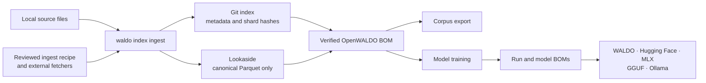

# WALDO

WALDO turns training data into reviewable, verifiable inputs—and carries that
provenance all the way into trained model releases.

It is one command-line tool connecting three deliberately separate things:

- a Git-governed index containing corpus meaning, sources, licenses, counts,
  and object hashes;
- content-addressed lookaside storage containing only canonical Parquet files;
  and
- local model runs whose BOMs identify the exact indexed material they used.

The result is an auditable path from acquired files to a portable WALDO,
Hugging Face, MLX, GGUF, or Ollama model package—without making Git store large
training blobs or making an object store define what those blobs mean.

> WALDO is an active, unreleased clean-slate rebuild. The core data lifecycle,
> real Apple Silicon training, inference, and model exports work end to end;
> the [current limits](#current-status-and-limits) are explicit below.

## The complete path



1. Acquire data into a local directory, directly or through an explicit ingest
   recipe that runs reviewed external fetcher scripts.
2. WALDO senses the input, streams it into canonical schema-1 Parquet, audits
   every new shard, uploads shards in parallel, and purges successful local
   staging objects.
3. WALDO produces a small Git review overlay containing manifests and index
   navigation. Large data never enters Git.
4. Index selections resolve recursively into immutable OpenWALDO BOMs that pin
   the Git revision, manifests, sources, licenses, shards, counts, and hashes.
5. Verification checks object availability without downloading bodies;
   full verification and audit can hash every object and validate every record.
6. Corpus exports and model training consume that same verified selection.
7. Training persists the plan before execution, records observed results after
   execution, and binds output weights into the model BOM.
8. A verified real run can be exported into one chosen runtime format, always
   with `BOM.json` and `EU-BOM.json`, and automatically signed when signing is
   configured.

## Why WALDO is structured this way

- **Git governs meaning.** Corpus descriptions, source and license assertions,
  conversion identity, counts, and shard references stay small and reviewable.
- **Lookaside storage serves bytes.** The only canonical lookaside objects are
  self-contained Parquet files addressed by SHA-256. There are no metadata
  sidecars, loose media files, or hidden catalogs in the object store.
- **BOMs cross boundaries.** Model code consumes a resolved OpenWALDO BOM, not
  mutable manifests or an unexplained directory of files.
- **Large operations stream.** Ingestion, verification, export, GGUF conversion,
  and training input avoid whole-corpus or whole-model intermediates.
- **Failure is visible.** Hash mismatches, incomplete disclosures, unavailable
  backends, corrupt records, and configured signing failures stop publication.
- **One binary does not mean one subsystem.** Index, record, lookaside, corpus,
  provenance, model, and training domains retain clear one-way dependencies.

Hashes prove identity and integrity; they do not prove that a license assertion
is legally correct, that a model is safe, or that a generated disclosure alone
establishes regulatory compliance. WALDO records attributable facts and the
limits of what it verified.

### The provenance chain

- A **corpus OpenWALDO BOM** pins one resolved index selection and travels in
  `EXPORT.json` or into a training run.
- `RUN-BOM.json` records the immutable training plan before the backend starts;
  observations and output hashes are persisted after execution.
- `MODEL-BOM.json` aggregates the model's complete run history and identifies
  the newest complete real-weight run as `current_run_id`.
- A native model export renames that aggregate to `BOM.json`. A derived runtime
  export writes a compact `BOM.json` inventory that identifies the selected run,
  hashes every release artifact, and pins the source model BOM by SHA-256.
- `EU-BOM.json` is the model-specific regulatory disclosure projection, not a
  second weight inventory or a replacement for the technical provenance tree.

## Build and inspect

WALDO currently requires Go 1.25 or newer.

```bash
cd /path/to/waldo-new
go build -o waldo ./cmd/waldo
./waldo --help
```

Every command supports focused help. Global `--json` emits stable structured
results while progress remains on standard error:

```bash
./waldo index verify --help
./waldo --json config get
```

## Configure the machine, not the corpus

Configuration contains local transport and execution choices. It never defines
corpus meaning.

```bash
waldo config get
waldo config set index /path/to/waldo-index
waldo config set lookaside file:///tmp/waldo-lookaside
waldo config set model.backend auto
```

For S3 publication:

```bash
waldo config set lookaside s3://bucket/prefix
waldo config set lookaside.region us-east-2
waldo lookaside login
```

`lookaside login` prompts for the S3 access key and secret, verifies real
write/list/read/delete access with a tiny probe object, and stores working
credentials in the operating-system keychain—not in WALDO configuration,
manifests, output, or shell history. AWS environment and workload-role
credentials remain available for headless use.

Durable defaults are intentionally conservative:

- models: `~/.waldo/models`;
- retained verified-object cache: `~/.waldo/cache`, bounded to 20 GiB; and
- partial downloads and ingestion recovery: user-scoped directories beneath
  the operating system's temporary directory.

All locations are discoverable with `waldo config get` and configurable with
`waldo config set`.

## Inspect and verify an index

Index paths are positional. A checkout, subtree, corpus directory, or manifest
path discovers its enclosing index, and recursive commands start at that path.

```bash
waldo index list /path/to/waldo-index/core
waldo index show /path/to/waldo-index/core/books
waldo index summary /path/to/waldo-index

# Metadata plus header-only canonical-object reachability and size checks.
waldo index verify /path/to/waldo-index/core/books

# Local metadata only, with no network access.
waldo index verify /path/to/waldo-index/core/books --offline

# Download and hash every selected object.
waldo index verify /path/to/waldo-index/core/books --objects

# Download shards, validate every canonical record, and reconcile totals.
waldo index audit /path/to/waldo-index/core/books
```

The default verification path deliberately avoids downloading entire objects.
It confirms each canonical URL is reachable and has the declared size.
`--objects` proves object hashes, while `audit` additionally recomputes record
identities, content hashes, reference token counts, required fields, duplicates,
and manifest totals.

## Ingest a corpus

Create a new schema-2 index when needed:

```bash
waldo index init ./waldo-index
waldo config set index ./waldo-index
waldo config set lookaside file:///tmp/waldo-lookaside
```

The `file://` lookaside is useful for local development and testing.
`waldo index init` writes the smallest valid index but deliberately leaves Git
initialization and the first commit to the user.

Direct ingestion accepts files or recursively scanned directories. WALDO can
probe text, Markdown, plain/gzip/zstd JSONL, and raw Parquet without using an
intermediate interchange file:

```bash
waldo index ingest ./acquired-data ./waldo-index/core/example \
  --title "Example corpus" \
  --description "A small example corpus." \
  --license CC-BY-4.0 \
  --source https://example.org/dataset \
  --source-category public-dataset
```

`--title`, `--license`, `--source`, and `--source-category` are required for
direct input. `--dry-run` probes the input and prints the conversion plan
without writing or uploading anything.

During a real run, progress identifies each input, conversion, shard, parallel
upload, remote verification, and successful local purge. The final output names
a small contribution overlay. Review that overlay, apply it to the index
checkout, inspect the Git diff, and commit it through the repository's normal
DCO/review workflow. WALDO does not silently commit or open a pull request.

### Ingest recipes and fetchers

Source-specific download logic intentionally lives in a separate
`waldo-fetchers` repository as shell scripts. A strict schema-1 ingest recipe
declares reviewed commands and corpus metadata; scripts only populate a
WALDO-owned temporary directory:

```bash
waldo index ingest ../waldo-fetchers/recipes/example.yaml \
  ./waldo-index/core/example
```

Recipe steps use `exec`. Bare commands resolve through `PATH`; paths resolve
relative to the recipe. WALDO hashes the recipe and executables before running
them sequentially, then sends their local output through the same probe,
conversion, audit, publication, purge, and contribution pipeline as direct
ingestion. Fetchers never mutate the index, upload lookaside objects, or train
models themselves.

## Export and inspect corpus data

Export one or more recursive index selections as native Parquet or canonical
JSONL. Every export includes `EXPORT.json`, containing the corpus OpenWALDO BOM
and hashes for all materialized files:

```bash
waldo index export core/books ./books-export
waldo index export core/books science/papers ./training-jsonl \
  --format jsonl \
  --exclude-license 'LicenseRef-*'

waldo bom show ./books-export
waldo bom verify ./books-export
```

Local shard tools work without an index or lookaside:

```bash
waldo shard summary ./books-export/data
waldo shard audit ./books-export/data
waldo shard list-records ./books-export/data/example.parquet
waldo shard export-record ./books-export/data/example.parquet "$RECORD_ID"
```

## Inspect lookaside storage

The retained cache and writable lookaside are separate. Cache entries are
verified local copies used by consumers; scratch holds partial downloads and is
purged after successful use.

```bash
waldo lookaside status
waldo lookaside list
waldo lookaside list /path/to/waldo-index/core/books
waldo lookaside list /path/to/waldo-index/core/books --all
waldo lookaside verify
```

With an index path, `lookaside list` normally shows only matching objects;
`--all` adds unmatched objects without claiming they are unreachable from every
other index or BOM. Destructive cleanup is intentionally explicit:

```bash
waldo lookaside rm "$OBJECT_SHA256"
```

There is no index-free garbage collector and no prefix, glob, or URL deletion.

## Forecast and train a model

Forecasting accepts a strict model compose or one or more index paths. It shows
only configurations that fit, names exact Apple, NVIDIA, or AMD accelerators,
and sorts approximate runtime from slowest to fastest:

```bash
waldo model forecast ./model.yaml
waldo model forecast core/books science/papers
```

Initialize an immutable architecture and train it directly on recursive index
selections:

```bash
waldo model init small --preset 10m
waldo model train small core/books --epochs 1
waldo model summary small
waldo model bom small
```

`train` resolves and deduplicates the selection, materializes hash-verified
shards through the bounded cache, audits every record, counts exact model-token
targets, persists the run BOM, and only then starts the backend. The default is
one epoch. Every run has an append-only planned/running/terminal lifecycle and
records backend identity, environment, observed consumption, losses,
checkpoints, and artifact hashes.

For a reusable architecture and ordered multi-stage plan, use a strict YAML or
JSON model compose:

```bash
waldo model compose composed-small ./model.yaml
```

Portable composes name architecture, corpora, objectives, and training
parameters—not MLX, PyTorch, or a host path. Machine-local `model.backend=auto`
selects the execution adapter. Today, real training and generation are
implemented through MLX on Apple Silicon; the fake backend is available only
when explicitly configured for deterministic testing.

After a real run:

```bash
waldo model chat small "Once upon a time"
waldo model chat small
```

The current pretrained models perform raw causal continuation and carry no
invented chat template. Instruction-following behavior requires future,
explicitly recorded fine-tuning support.

## Export a model release

Configure reusable provider-level disclosure facts once:

```bash
waldo config set disclosure.provider docs/examples/eu-gpai-provider.json
```

Then export exactly one representation:

```bash
# Complete native WALDO archive; the default format.
waldo model export small ./small-waldo

waldo model export small ./small-huggingface --format huggingface
waldo model export small ./small-mlx --format mlx
waldo model export small ./small-gguf --format gguf
waldo model export small ./small-ollama --format ollama

ollama create small -f ./small-ollama/Modelfile
```

Every package contains `BOM.json` and `EU-BOM.json`. Derived runtime formats
select the newest complete, non-simulated real run and verify its model pin,
configuration, tokenizer, weights, sizes, and hashes before conversion.
Hugging Face and MLX preserve tensor bytes while translating names and runtime
metadata. GGUF v3 is streamed directly, embeds the byte tokenizer, and does not
imply quantization. Ollama adds only a portable relative `Modelfile`; no export
duplicates large weight formats.

The native WALDO package is the self-contained provenance archive. Derived
packages remain compact by recording the source model BOM's hash rather than
copying its complete run tree, so retain or publish the native package when the
full technical history must travel with a release.

A normal export fails when required disclosure facts are unavailable.
`--allow-incomplete` permits a clearly marked regulatory draft; it never
bypasses model or artifact verification. When `signing.method` is configured,
WALDO signs both BOMs with Sigstore before atomic publication and fails closed
if signing fails. Without signing configuration, export succeeds with an
unsigned warning.

## Current status and limits

Working end to end today:

- schema-2 index and schema-1 manifest compatibility with the public index;
- recursive index inspection, availability verification, object hashing, and
  full record audit;
- local and S3 lookaside publication, internal AWS SDK access, keychain-backed
  credentials, retained cache, scratch cleanup, inventory, and explicit remove;
- streaming direct and recipe-driven ingestion into canonical schema-1 Parquet;
- native Parquet and canonical JSONL corpus exports with offline-verifiable BOMs;
- local shard summary, audit, record listing, and record export;
- immutable model plans, append-only runs, forecasting, direct training, and
  model composes;
- real MLX training and generation on Apple Silicon;
- native WALDO, Hugging Face, MLX, GGUF, and Ollama model exports;
- machine-readable EU GPAI disclosure mapping and gap analysis; and
- optional fail-closed Sigstore signing for model release BOMs.

Still deliberately pending:

- PyTorch, TorchTitan, and TensorFlow execution adapters—the Linux resolver and
  backend boundary exist, but MLX is the only real trainer today;
- model import, quantized GGUF variants, SFT, preference training, pinned chat
  templates, held-out evaluation, and cluster orchestration;
- rendering the exact official editable EU template rather than the current
  versioned JSON mapping;
- append/update/remove index contribution workflows and lookaside mirroring;
- automated Git commits or pull requests; and
- packaging and a supported public release.

## Documentation

- [Product vision and guarantees](VISION.md)
- [CLI and UX contract](docs/UX.md)
- [Architecture and domain boundaries](docs/ARCHITECTURE.md)
- [Ingestion and canonical Parquet](docs/INGESTION-DESIGN.md)
- [Fetcher and ingest-recipe contract](docs/FETCHER-CONTRACT.md)
- [Corpus OpenWALDO BOM](docs/OPENWALDO-BOM.md)
- [Model lifecycle and training](docs/MODEL-LIFECYCLE.md)
- [Model formats, release BOMs, and signing](docs/MODEL-EXPORTS.md)
- [EU GPAI disclosure mapping](docs/EU-GPAI-DISCLOSURE.md)
- [Architectural decisions](docs/adr/README.md)
- [Implementation roadmap](docs/ROADMAP.md)
- [Testing guide](testing/README.md)

## Development

The local suite covers unit tests, static analysis, direct and recipe-driven
ingestion, the fake model lifecycle, and a real disposable MLX lifecycle when
Metal-capable MLX is installed:

```bash
./testing/all.sh
```

Live S3 and public-index tests are guarded and never run implicitly. See
[the testing guide](testing/README.md) for their explicit opt-in contracts.

Before changing code, read [AGENTS.md](AGENTS.md), then the relevant design
contract or ADR. This repository preserves the public data contract where it
matters; it does not preserve the former backend's internal complexity.
