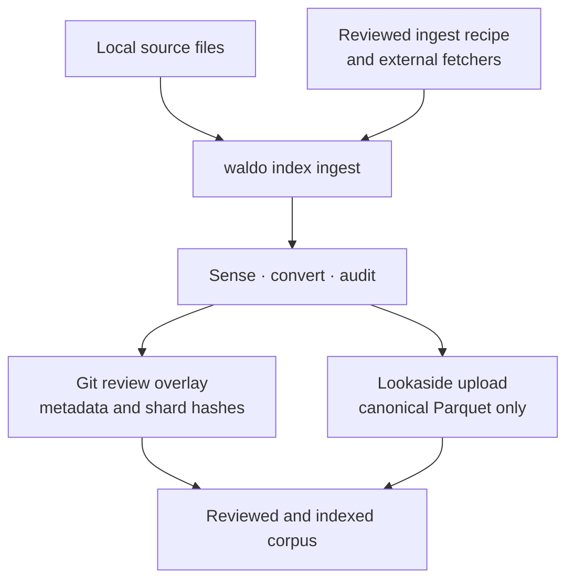
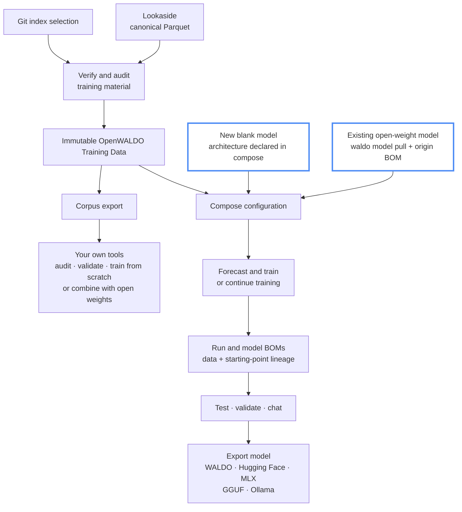
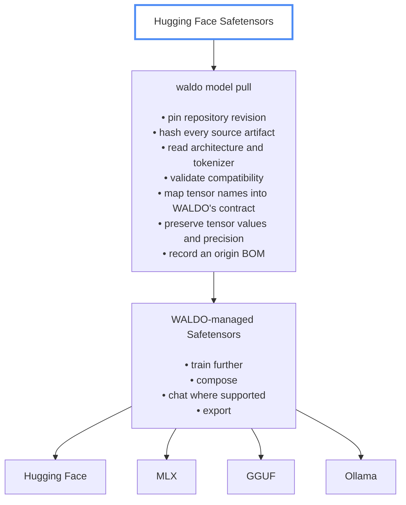

# WALDO

**Open Weights. Open Artifacts. Open Licenses. Open Data. Open Origins.**<br>

## **OpenWALDO.**

WALDO turns 100% freely available and auditable training data into reviewable,
verifiable inputs—and carries that provenance all the way into trained model
releases. It is one command-line tool connecting three deliberately separate
things:

- a Git-governed, YAML-primary index containing corpus meaning, sources,
  licenses, counts, and object hashes, with read compatibility for existing
  JSON metadata;
- content-addressed lookaside storage containing only canonical Parquet files;
  and
- local model build and validation tools including support for BOMs that
  identify the exact indexed material they used.

The result is an auditable path from acquired files to a portable WALDO,
Hugging Face, MLX, GGUF, or Ollama exported model.

## The complete path

### Contributing data



1. Acquire data into a local directory, directly or through an explicit ingest
   recipe that runs reviewed external fetcher scripts.
2. WALDO senses the input, streams it into canonical schema-1 Parquet, audits
   every new shard, uploads shards in parallel, and purges successful local
   staging objects.
3. WALDO produces a small Git review overlay containing manifests and index
   navigation. Review and commit that metadata through the normal Git workflow;
   large data remains in lookaside storage and never enters Git.

### Using and training the data



1. Select any index, subtree, or corpus. WALDO recursively validates its
   metadata and checks the referenced Parquet objects; a full audit can hash
   every object and validate every canonical record.
2. The verified selection becomes an immutable OpenWALDO BOM that pins the Git
   revision, manifests, sources, licenses, shards, counts, and hashes.
3. Exported corpus data can be audited independently, consumed by another
   training stack, used to train from scratch, or paired with an open-weight
   base model for continued training or fine-tuning.
4. A WALDO compose can start with a blank architecture or a locally managed
   open-weight base. `model pull` resolves Hugging Face Safetensors to an
   immutable revision, validates and losslessly normalizes them, and pins a
   model-origin BOM before the same compose lifecycle runs. General tokenizer
   support and supervised fine-tuning objectives remain pending.
5. WALDO persists the corpus BOM and starting-point identity before execution,
   records observed results afterward, and binds output weights into append-only
   run and model BOMs.
6. A verified origin or real run can be tested, used for generation where a
   compatible runtime exists, and converted from retained training-quality
   Safetensors into one chosen runtime format. Every
   package contains `BOM.json` and `EU-BOM.json`, and both are automatically
   signed when signing is configured.

## Why WALDO is structured this way

- **Git governs meaning.** Corpus descriptions, source and license assertions,
  conversion identity, counts, and shard references stay small and reviewable.
- **Lookaside storage serves bytes.** The only canonical lookaside objects are
  self-contained Parquet files addressed by SHA-256. There are no metadata
  sidecars, loose media files, or hidden catalogs in the object store.
- **BOMs cross boundaries.** Model code consumes a resolved OpenWALDO BOM, not
  mutable manifests or an unexplained directory of files.
- **Large operations stream.** Ingestion, verification, export, GGUF conversion,
  and training input avoid whole-corpus or whole-model intermediates.
- **Failure is visible.** Hash mismatches, incomplete disclosures, unavailable
  backends, corrupt records, and configured signing failures stop publication.
- **One binary does not mean one subsystem.** Index, record, lookaside, corpus,
  provenance, model, and training domains retain clear one-way dependencies.

Hashes prove identity and integrity; they do not prove that a license assertion
is legally correct, that a model is safe, or that a generated disclosure alone
establishes regulatory compliance. WALDO records attributable facts and the
limits of what it verified.

### The provenance chain

- A **corpus OpenWALDO BOM** pins one resolved index selection and travels in
  `EXPORT.json` or into a training run.
- `RUN-BOM.json` records the immutable training plan before the backend starts;
  observations and output hashes are persisted after execution.
- `ORIGIN-BOM.json` pins an external starting checkpoint when present.
  `MODEL-BOM.json` aggregates that origin and the complete run history, using
  `current_origin_sha256` until a newer complete real run becomes
  `current_run_id`.
- A native model export renames that aggregate to `BOM.json`. A derived runtime
  export writes a compact `BOM.json` inventory that identifies the selected
  origin or run, hashes every release artifact, and pins the source model BOM
  by SHA-256.
- `EU-BOM.json` is the model-specific regulatory disclosure projection, not a
  second weight inventory or a replacement for the technical provenance tree.

## Install and inspect

WALDO currently requires Go 1.25 or newer.

```bash
cd /path/to/waldo
go install ./cmd/waldo

WALDO_GOBIN="$(go env GOBIN)"
[ -n "$WALDO_GOBIN" ] || WALDO_GOBIN="$(go env GOPATH)/bin"
export PATH="$WALDO_GOBIN:$PATH"

command -v waldo
waldo --help
```

`go install` writes the executable to `GOBIN`, or to `GOPATH/bin` when
`GOBIN` is unset. Add the resolved `WALDO_GOBIN` directory to your shell startup
configuration so `waldo` remains available in future terminals.

Every command supports focused help. Global `--json` emits stable structured
results while progress remains on standard error:

```bash
waldo index verify --help
waldo --json config get
```

## Configure the machine, not the corpus

Configuration contains local transport and execution choices. It never defines
corpus meaning.

```bash
waldo config get
waldo config set index /path/to/waldo-index
waldo config set lookaside file:///tmp/waldo-lookaside
waldo config set model.backend auto
```

With `index` unset, WALDO uses a managed, read-only checkout at
`~/.waldo/index`. It clones `openwaldo/waldo-index` on first use. Commands that
consume an index automatically fetch and fast-forward its tracking branch when
the checkout is clean and behind. Dirty, ahead, or diverged checkouts fail
without modification. `waldo index pull` provides explicit synchronization.

Setting `index` selects a contributor checkout instead. Every relative index
path—including one beginning with `./`—then resolves beneath it. Absolute paths
and paths beginning with `~/` explicitly select another checkout. If a
command's index selection is omitted, WALDO uses the entire resolved index.
Synchronization follows the selected checkout's
current branch and configured tracking remote; it is not chosen by pathname.

For S3 publication:

```bash
waldo config set lookaside s3://bucket/prefix
waldo config set lookaside.region us-east-2
waldo lookaside login
```

`lookaside login` prompts for the S3 access key and secret, verifies real
write/list/read/delete access with a tiny probe object, and stores working
bucket-scoped credentials in `~/.waldo/credentials` with mode `0600`—not in
WALDO configuration, manifests, output, or shell history. AWS environment,
shared-file, and workload-role credentials remain available when no WALDO
login exists.

Default locations are intentionally conservative:

- managed read-only index: `~/.waldo/index`;
- models: `~/.waldo/models`;
- retained verified-object cache, bounded to 20 GiB; partial downloads; and
  ingestion recovery: separate user-scoped directories beneath
  the operating system's temporary directory.

All locations are discoverable with `waldo config get` and configurable with
`waldo config set`.

## Inspect and verify an index

Index paths are positional. A checkout, subtree, corpus directory, or manifest
path discovers its enclosing index, and recursive commands start at that path.

```bash
waldo index list /path/to/waldo-index/core
waldo index show /path/to/waldo-index/core/books
waldo index summary /path/to/waldo-index

# Metadata plus header-only canonical-object reachability and size checks.
waldo index verify /path/to/waldo-index/core/books

# Local metadata only, with no network access.
waldo index verify /path/to/waldo-index/core/books --offline

# Download and hash every selected object.
waldo index verify /path/to/waldo-index/core/books --objects

# Download shards, validate every canonical record, and reconcile totals.
waldo index audit /path/to/waldo-index/core/books
```

The default verification path deliberately avoids downloading entire objects.
It confirms each canonical URL is reachable and has the declared size.
`--objects` proves object hashes, while `audit` additionally recomputes record
identities, content hashes, reference token counts, required fields, duplicates,
and manifest totals.

## Ingest a corpus

Clone and select a writable contributor checkout of the public index:

```bash
git clone https://github.com/openwaldo/waldo-index.git ./waldo-index
waldo config set index ./waldo-index
waldo config set lookaside file:///tmp/waldo-lookaside
```

`~/.waldo/index` is reserved for WALDO-managed reads. `index init`, `index
ingest`, and `index update` refuse to modify it. `waldo index init` remains
available for creating a separate new schema-1 index.

The `file://` lookaside is useful for local development and testing.

Direct ingestion accepts files or recursively scanned directories. WALDO can
probe text, Markdown, plain/gzip/zstd JSONL, and raw Parquet without using an
intermediate interchange file:

```bash
waldo index ingest ./acquired-data core/example \
  --title "Example corpus" \
  --description "A small example corpus." \
  --license CC-BY-4.0 \
  --source https://example.org/dataset \
  --source-category public-dataset
```

`--title`, `--license`, `--source`, and `--source-category` are required for
direct input. `--dry-run` probes the input and prints the conversion plan
without writing or uploading anything.

During a real run, progress identifies each input, conversion, shard, parallel
upload, remote verification, and successful local purge. The final output names
a small contribution overlay. Review that overlay, apply it to the index
checkout, inspect the Git diff, and commit it through the repository's normal
DCO/review workflow. WALDO does not silently commit or open a pull request.

### Ingest recipes and fetchers

Source-specific download logic intentionally lives in a separate
`waldo-fetchers` repository as shell scripts. A strict schema-1 ingest recipe
declares reviewed commands and corpus metadata; scripts only populate a
WALDO-owned temporary directory:

```bash
waldo index ingest ../waldo-fetchers/recipes/example.yaml \
  core/example
```

Recipe steps use `exec`. Bare commands resolve through `PATH`; paths resolve
relative to the recipe. WALDO hashes the recipe and executables before running
them sequentially, then sends their local output through the same probe,
conversion, audit, publication, purge, and contribution pipeline as direct
ingestion. Fetchers never mutate the index, upload lookaside objects, or train
models themselves.

## Export and inspect corpus data

Export one or more recursive index selections as native Parquet or canonical
JSONL. Every export includes `EXPORT.json`, containing the corpus OpenWALDO BOM
and hashes for all materialized files:

```bash
waldo index export core/books ./books-export
waldo index export core/books science/papers ./training-jsonl \
  --format jsonl \
  --exclude-license 'LicenseRef-*'

# With no selection, export the entire resolved index (and warn).
waldo index export ./complete-index-export

waldo index bom ./books-export
waldo index verify ./books-export
```

Local shard tools work without an index or lookaside:

```bash
waldo shard summary ./books-export/data
waldo shard audit ./books-export/data
waldo shard list-records ./books-export/data/example.parquet
waldo shard export-record ./books-export/data/example.parquet "$RECORD_ID"
```

## Inspect lookaside storage

The retained cache and writable lookaside are separate. Cache entries are
verified local copies used by consumers; scratch holds partial downloads and is
purged after successful use.

```bash
waldo lookaside status
waldo lookaside list
waldo lookaside list /path/to/waldo-index/core/books
waldo lookaside list /path/to/waldo-index/core/books --all
waldo lookaside verify
```

Unlike corpus-consuming commands, argumentless `lookaside list` is an
unfiltered storage inventory and does not select or warn about an index. Use
`waldo lookaside list .` to filter against the entire resolved index. With
an index path, `lookaside list` normally shows only matching objects;
`--all` adds unmatched objects without claiming they are unreachable from every
other index or BOM. Destructive cleanup is intentionally explicit:

```bash
waldo lookaside rm "$OBJECT_SHA256"
```

There is no index-free garbage collector and no prefix, glob, or URL deletion.

## Forecast and train a model

Forecasting accepts a strict model compose or one or more index paths. It shows
only configurations that fit, names exact Apple, NVIDIA, or AMD accelerators,
and sorts approximate runtime from slowest to fastest:

```bash
waldo model forecast ./model.yaml
waldo model forecast core/books science/papers
waldo model forecast # entire resolved index, with a warning
```

Initialize an immutable architecture and train it directly on recursive index
selections:

```bash
waldo model init small --preset 10m
waldo model train small core/books --epochs 1
waldo model train small --epochs 1 # entire resolved index, with a warning
waldo model summary small
waldo model bom small
```

`train` resolves and deduplicates the selection, materializes hash-verified
shards through the bounded cache, counts exact model-token targets, persists
the run BOM, and only then starts the backend. `--audit` additionally validates
shard structure, attestations, and declared totals before training. The default
is one epoch. Every run has an append-only planned/running/terminal lifecycle
and records backend identity, environment, observed consumption, losses,
checkpoints, and artifact hashes.

`model summary` evaluates the latest run and its `TELEMETRY.csv` locally, then
reports whether to let it run, inspect it, stop it, fix it, or review a
completed result. `advisor` starts a conversational assistant grounded
in the model's saved compose, runs, and current telemetry. It can explain the
model, assess a live run, and propose a next experiment:

```bash
waldo config set ai.provider openai
waldo config set ai.api-key "$API_KEY"
waldo advisor small
```

The advisor also receives a compact inventory of every corpus in the
configured index, including paths, titles, sizes, token/document totals, and
licenses, so it can recommend and validate broader corpus mixtures. If `small`
does not exist, the advisor interviews you about the intended model, data,
hardware, runtime, context, evaluation, and license constraints. It then asks
before writing `<name>-advisor.yaml` and asks again before starting training.
For an existing model it never edits the immutable compose stored with the
model. `waldo model advisor` remains a compatibility form, and local status
remains available without any provider through `model summary`.
Anthropic model overrides use Messages API IDs such as `claude-sonnet-5` or
`claude-opus-5`; Claude Code shorthand names such as `sonnet` and `opus` are
not API model IDs.

For a reusable architecture and ordered multi-stage plan, use a strict YAML or
JSON model compose:

```bash
waldo model compose composed-small ./model.yaml
```

Runnable [reference composes](composes/README.md) range from a small
Mac-friendly babble model through 2, 6, 12, 24, and 48 hour single-H200
training budgets.

Portable composes name architecture, corpora, objectives, and training
parameters—not MLX, PyTorch, or a host path. Machine-local `model.backend=auto`
selects MLX on Apple Silicon and prefers TorchTitan, then PyTorch, on Linux.
Real training is implemented through MLX, single-process PyTorch, and
single-node distributed TorchTitan; generation currently uses MLX. The fake
backend is available only when explicitly configured for deterministic testing.

After a real run:

```bash
waldo model chat small "Once upon a time"
waldo model chat small
```

The current pretrained models perform raw causal continuation and carry no
invented chat template. Instruction-following behavior requires future,
explicitly recorded fine-tuning support.

### Continue training an open-weight model

WALDO pulls training-quality open weights directly into its managed model
root:



```bash
waldo model pull llama-base \
  huggingface://organization/model@<immutable-revision>

waldo model summary llama-base
waldo model bom llama-base
waldo model train llama-base core/books --epochs 1
waldo model export llama-base ./llama-continued --format huggingface
```

`model pull` defaults to a Hugging Face model directory containing
Safetensors, architecture configuration, and tokenizer files. A revision may
be supplied explicitly; otherwise WALDO will resolve the requested reference
to an immutable repository revision before accepting any artifacts. Native
WALDO packages will remain the lossless WALDO-to-WALDO transfer format.

For a supported architecture, WALDO will:

1. inventory and hash every acquired source artifact;
2. capture the source repository, immutable revision, upstream model card,
   license, and BOM when available;
3. validate the architecture, tokenizer, tensor names, shapes, and precision;
4. stream-map compatible tensor names into WALDO's internal Safetensors
   contract without quantization or numerical conversion; and
5. persist a separate immutable model-origin record before allowing training.

The pulled origin is not represented as a training run. Subsequent
`model train` and model-compose stages append ordinary runs that pin the exact
origin BOM and initialization-weight hash. Missing upstream provenance remains
an explicit disclosure gap rather than being inferred. Unsupported
architectures or tokenizers fail before a managed model is published.

The first compatibility profile is deliberately narrow: standard bias-free
Llama Safetensors using WALDO's schema-1 byte tokenizer. This is the
training-quality format emitted by WALDO's Hugging Face export. General
Hugging Face tokenizer support remains future work; WALDO fails closed instead
of silently retokenizing a model or changing its tensor values.

GGUF is intentionally not the default pull format because it is commonly
quantized for inference. WALDO derives GGUF, Ollama, and MLX packages from the
retained training-quality weights during export. A later `model push`
command can publish one deliberately selected representation back to Hugging
Face without bundling redundant weight formats.

## Export a model release

Configure reusable provider-level disclosure facts once:

```bash
waldo config set disclosure.provider docs/examples/eu-gpai-provider.json
```

Then export exactly one representation:

```bash
# Complete native WALDO archive; the default format.
waldo model export small ./small-waldo

waldo model export small ./small-huggingface --format huggingface
waldo model export small ./small-mlx --format mlx
waldo model export small ./small-gguf --format gguf
waldo model export small ./small-ollama --format ollama

# Optional derived inference weights; exact Q4_K_M is recorded in BOM.json.
waldo model export small ./small-q4 --format gguf --quant 4

# Optional bounded importance calibration from a verified index selection.
waldo model export small ./small-q4-calibrated \
  --format gguf --quant 4 --calibration core/books

ollama create small -f ./small-ollama/Modelfile
```

Every package contains `BOM.json` and `EU-BOM.json`. Derived runtime formats
select either the current verified pulled origin or the newest complete,
non-simulated real run and verify its model pin, configuration, tokenizer,
weights, sizes, and hashes before conversion.
Hugging Face and MLX preserve tensor bytes while translating names and runtime
metadata. GGUF v3 is streamed directly and embeds the byte tokenizer;
quantization happens only when `--quant` is explicit. `--calibration` selects a
bounded deterministic sample from verified index shards and does not train or
change the source model. Ollama adds only a portable relative `Modelfile`; no export
duplicates large weight formats.

The native WALDO package is the self-contained provenance archive. Derived
packages remain compact by recording the source model BOM's hash rather than
copying its complete run tree, so retain or publish the native package when the
full technical history must travel with a release.

A normal export fails when required disclosure facts are unavailable.
`--allow-incomplete` permits a clearly marked regulatory draft; it never
bypasses model or artifact verification. When `signing.method` is configured,
WALDO signs both BOMs with Sigstore before atomic publication and fails closed
if signing fails. Without signing configuration, export succeeds with an
unsigned warning.

## Current status and limits

Working end to end today:

- **Data governance:** YAML-primary schema-1 directory indexes and corpus
  manifests with JSON read compatibility, canonical Parquet records, recursive
  inspection, lightweight availability checks, object hashing, and full
  record-level audits;
- **Storage:** local and S3 lookaside publication through the AWS SDK,
  protected `~/.waldo/credentials`, ordered read mirrors, bounded verified caching,
  scratch cleanup, inventory, scrubbing, and explicit object removal;
- **Contribution:** streaming direct and recipe-driven ingestion of text,
  Markdown, JSONL, compressed JSONL, and raw Parquet; parallel publication;
  post-write audit; local purge; a small Git review overlay; and source-aware
  append or complete recipe-driven rebuilding of existing corpora with
  automatic YAML migration;
- **Corpus use:** native Parquet and canonical JSONL exports with
  offline-verifiable BOMs, plus local shard summary, audit, record listing, and
  individual record export;
- **Model lifecycle:** immutable architectures, append-only run records,
  forecasting, pinned open-weight pulls, direct index-backed training,
  pulled-base and blank-architecture model composes, model inspection, and
  complete data-to-weight provenance;
- **Execution:** real MLX training and generation on Apple Silicon,
  single-process PyTorch training on Linux CPU, NVIDIA CUDA, or AMD ROCm, and
  single-node distributed TorchTitan training across all visible Linux GPUs;
- **Training reliability:** deterministic bounded held-out evaluation with
  immutable selection evidence, atomic weight/optimizer/runtime checkpoints,
  exact same-run resume after interrupted direct training, durable resumable
  model-compose transactions, and observed-run forecast calibration;
- **Release:** separate native WALDO, Hugging Face, MLX, GGUF, and Ollama
  packages, each with technical and EU BOMs, plus quantized GGUF/Ollama with
  optional index-backed calibration evidence; and
- **Disclosure and signing:** machine-readable EU GPAI mapping and gap analysis,
  plus optional fail-closed Sigstore signing of model release BOMs.

Still deliberately pending:

- **Data and index:** non-text/multimodal ingestion and corpus removal
  contributions with guarded optional object deletion;
- **Model lineage and tuning:** general Hugging Face tokenizer/architecture
  profiles, SFT, preference training, and pinned chat templates;
- **Additional execution:** PyTorch generation, a TensorFlow adapter, and
  multi-node TorchTitan rendezvous, scheduler, and cluster orchestration;
- **Additional release formats:** rendering the exact official editable EU
  template instead of only its versioned JSON mapping; and
- **Distribution:** Hugging Face model push, installable packages, migration
  guidance, website reconciliation, and a supported public release.

WALDO intentionally does not commit index changes or open pull requests. It
prepares a deterministic contribution overlay so normal Git review, DCO, and
repository policy remain visible.

## Documentation

- [Product vision and guarantees](VISION.md)
- [CLI and UX contract](docs/UX.md)
- [Architecture and domain boundaries](docs/ARCHITECTURE.md)
- [Ingestion and canonical Parquet](docs/INGESTION-DESIGN.md)
- [Source directory contract](docs/SOURCE-DIRECTORY.md)
- [Fetcher and ingest-recipe contract](docs/FETCHER-CONTRACT.md)
- [Corpus OpenWALDO BOM](docs/OPENWALDO-BOM.md)
- [Model lifecycle and training](docs/MODEL-LIFECYCLE.md)
- [Training, tuning, and quantization calibration](docs/TRAINING-AND-CALIBRATION.md)
- [Model formats, release BOMs, and signing](docs/MODEL-EXPORTS.md)
- [EU GPAI disclosure mapping](docs/EU-GPAI-DISCLOSURE.md)
- [Architectural decisions](docs/adr/README.md)
- [Implementation roadmap](docs/ROADMAP.md)
- [Prioritized remaining work](TODO.md)
- [Testing guide](testing/README.md)

## Development

The local suite covers unit tests, static analysis, direct and recipe-driven
ingestion, and the fake model lifecycle. It also runs disposable real MLX,
PyTorch, and TorchTitan lifecycles when their required operating system,
runtime, and accelerator are available; otherwise each hardware test reports
an explicit skip:

```bash
./testing/all.sh
```

Live S3 and public-index tests are guarded and never run implicitly. See
[the testing guide](testing/README.md) for their explicit opt-in contracts.

Before changing code, read [AGENTS.md](AGENTS.md), then the relevant design
contract or ADR. This repository preserves the public data contract where it
matters; it does not preserve the former backend's internal complexity.

## License

WALDO is licensed under the [Apache License, Version 2.0](LICENSE).
